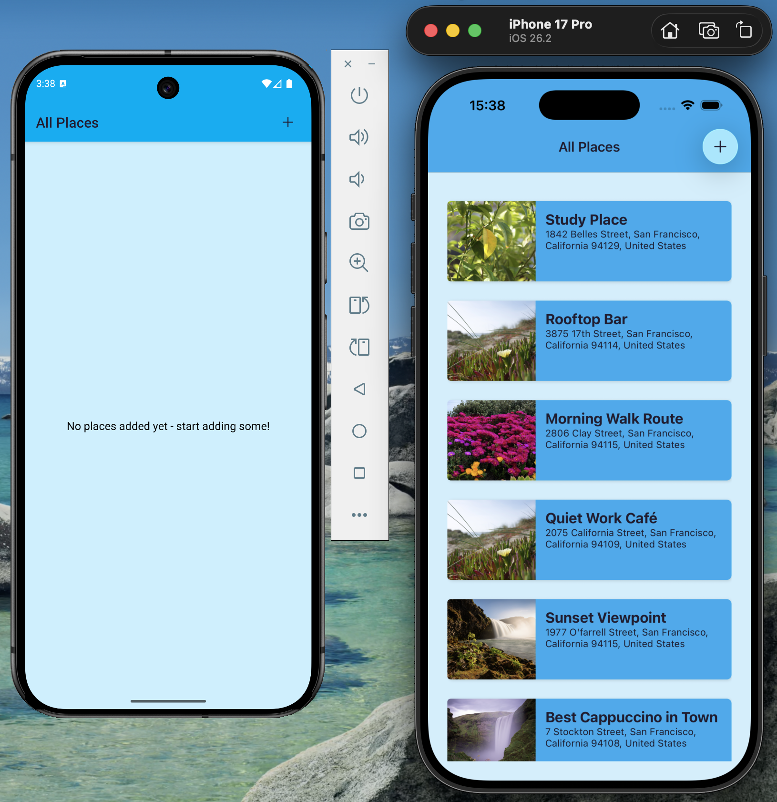
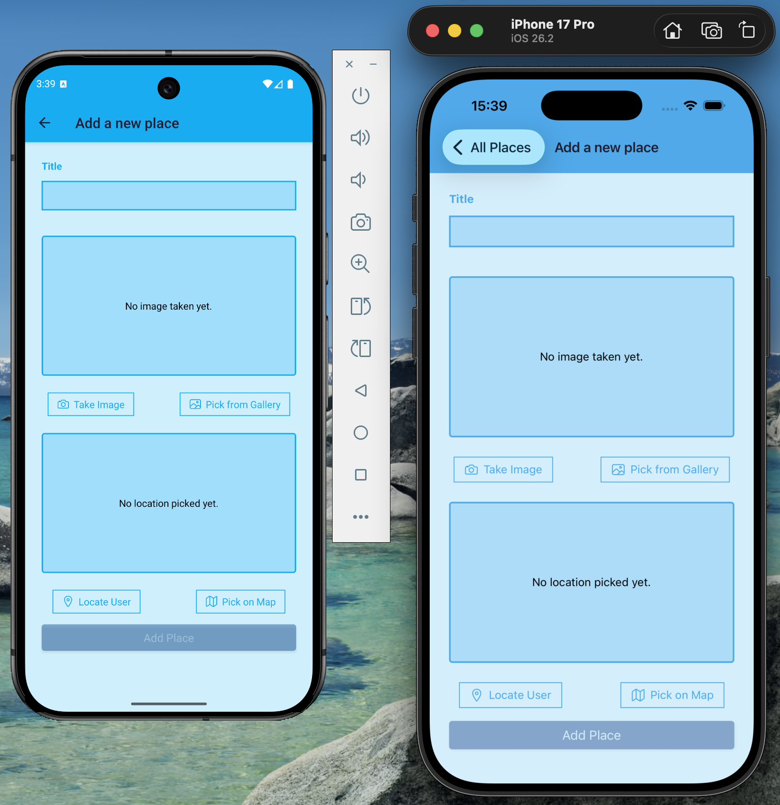
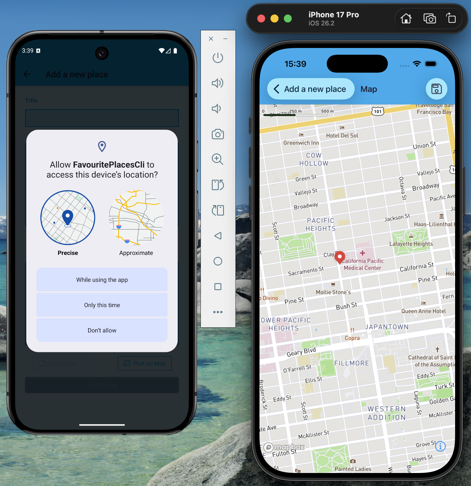
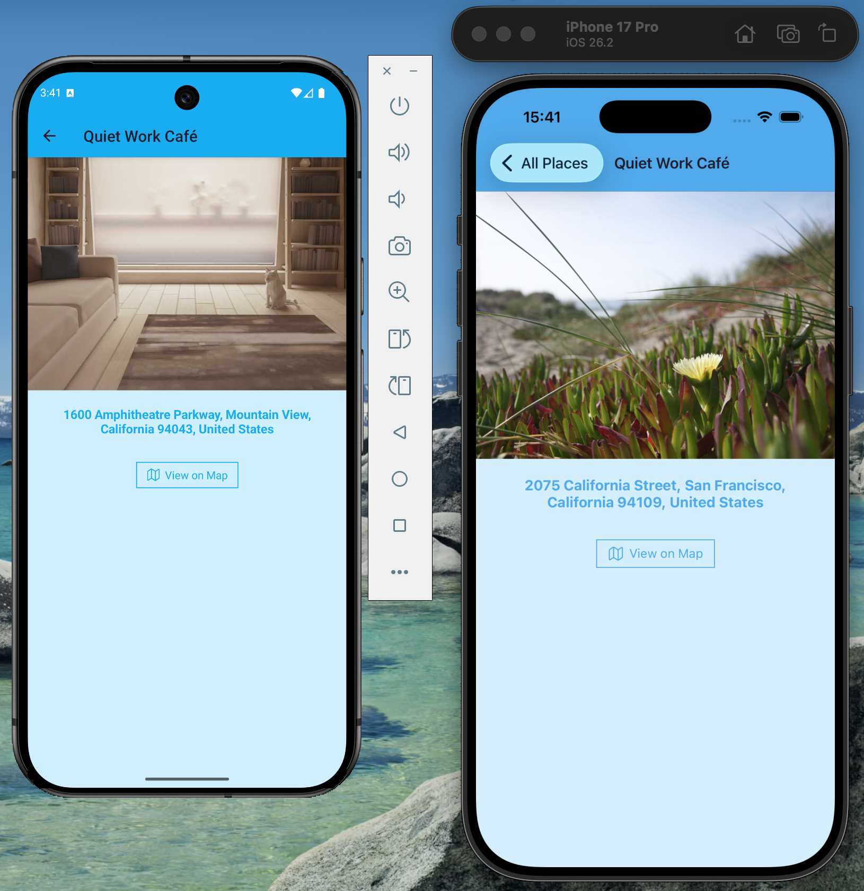
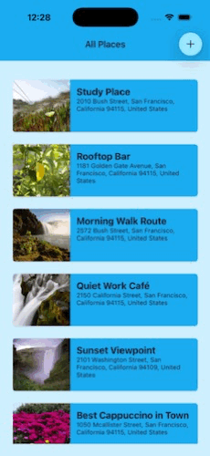

# Favorite Places React Native CLI

## 🎯 Project Overview

A React Native CLI mobile app for **iOS** and **Android** that lets users save favorite places with a photo, a readable address, and map coordinates.

Built with **React Native CLI**, **TypeScript**, **SQLite**, and **Mapbox**, the project demonstrates native mobile integrations such as **camera/gallery access**, **location permissions**, **map-based place selection**, and **offline local persistence**.

---

## Preview

Screenshots and demo recordings from both platforms.

### Screenshots

| All Places | Add Place |
|---|---|
|  |  |

| Map Picker | Place Details |
|---|---|
|  |  |

### Demo

Short demo recordings of the app running on both platforms.

#### iOS


#### Android


---

## 📱 Why I Built This

I built this project to practice working with real mobile features beyond basic UI and CRUD flows. The main goal was to create a small but complete mobile app that includes:

- native device permissions
- camera and gallery integration
- geolocation
- interactive maps
- offline storage with SQLite
- loading, error, and retry states across core screens

This project is intentionally scoped as a focused learning and portfolio app rather than a large-scale production product.

---

## 📸 Key Features

- Save favorite places with a custom title
- Capture a photo with the camera or choose one from the gallery
- Save camera-taken photos to a dedicated **FavoritePlaces** device album when permissions allow it
- Use the current GPS location or select a point directly on the map
- Reverse-geocode coordinates into a readable address
- Persist saved places locally with **SQLite**
- View saved places in a list and inspect them in a details screen
- Open saved places on a **Mapbox** map
- Handle loading, error, and retry states in important user flows

---

## 🛠️ Tech Stack

- **React Native CLI**
- **TypeScript**
- **React Navigation**
- **Mapbox** via `@rnmapbox/maps`
- **SQLite** via `@op-engineering/op-sqlite`
- **react-native-image-picker**
- **@react-native-camera-roll/camera-roll**
- **react-native-geolocation-service**
- **react-native-config**
- **react-native-bootsplash**
- **react-native-vector-icons**
- **react-native-view-shot**

---

## 💡 What This Project Demonstrates

- React Native CLI setup for both **Android** and **iOS**
- Type-safe screen navigation and component props with **TypeScript**
- Local offline persistence using **SQLite**
- Integration with native mobile features such as:
  - camera
  - gallery
  - location services
  - permissions
  - local photo library
- Interactive maps and reverse geocoding with **Mapbox**
- Practical mobile UX work:
  - bootstrap initialization
  - loading states
  - retry actions
  - permission-denied flows
  - map loading fallback behavior
- Basic project quality tooling with:
  - linting
  - formatting checks
  - GitHub Actions CI

---

## 📂 Project Structure

```text
src/
  components/   # Reusable UI and place-related components
  constants/    # Shared constants and styles
  hooks/        # Custom hooks
  models/       # Domain models
  screens/      # Application screens
  store/        # Lightweight temporary state utilities
  types/        # Shared TypeScript types
  util/         # Database, location, permission, and Mapbox helpers
```

---

## App Flow

### All Places
Displays all saved places loaded from the local SQLite database.

### Add Place
Lets the user:
- enter a title
- take a photo or choose one from the gallery
- use current location or pick a location on the map

### Map
Used for:
- selecting a location while creating a place
- viewing an existing saved place on the map

The screen includes loading handling and retry behavior to improve reliability around map initialization.

### Place Details
Shows:
- the saved image
- the resolved address
- a button to open the location on the map

The screen also includes loading, error, and retry states.

---

## 🚀 Getting Started

### Prerequisites

Before running the project, make sure you have:

- **Node.js** `22.11.0` or newer
- **npm**
- React Native environment set up
- **Android Studio** for Android
- **Xcode** and **CocoaPods** for iOS
- a valid **Mapbox access token**

Official React Native setup guide:  
https://reactnative.dev/docs/set-up-your-environment

---

## 🔑 Environment Variables

Create a `.env` file in the project root:

```env
MAPBOX_ACCESS_TOKEN=your_mapbox_access_token_here
```

An `.env.example` file is included in the repository as a template.

Get your token from [Mapbox](https://mapbox.com).

---

## Installation

Install dependencies:

```sh
npm install
```

### iOS only

Install Ruby gems if needed:

```sh
bundle install
```

Install CocoaPods dependencies:

```sh
bundle exec pod install --project-directory=ios
```

---

## Running the App

Start Metro:

```sh
npm start
```

### Run on Android

```sh
npm run android
```

### Run on iOS

```sh
npm run ios
```

---

## 📋 Permissions Required

This app may request access to:

- **Location**
- **Camera**
- **Photo Library / Gallery**

### Android
Depending on the OS version and device configuration, the app may request:
- camera permission
- fine location
- coarse location

### iOS
The app may request:
- when-in-use location permission
- camera access
- photo library access

If permission is denied permanently, the app can guide the user to system settings.

---

## 📊 Data Storage

Saved places are stored locally in **SQLite**.

Each place includes:
- `id`
- `title`
- `imageUri`
- `address`
- `lat`
- `lng`

This app does **not** use a backend or cloud sync. Data is stored locally on the device.

---

## 🗺️ Map and Geocoding

The app uses **Mapbox** for:
- map rendering
- static map preview generation
- reverse geocoding coordinates into an address

Mapbox configuration is centralized and initialized during app bootstrap.

---

## 🚧 Development Scripts

```json
{
  "android": "react-native run-android",
  "ios": "react-native run-ios",
  "format": "prettier --write \"App.tsx\" \"index.js\" \"src/**/*.{ts,tsx,js,jsx}\"",
  "format:check": "prettier --check \"App.tsx\" \"index.js\" \"src/**/*.{ts,tsx,js,jsx}\"",
  "lint": "eslint .",
  "start": "react-native start",
  "test": "jest"
}
```

---

## CI

The repository includes a GitHub Actions workflow that runs:

- `npm ci`
- `npm run lint`
- `npm run format:check`

---

## 🎓 Challenges and Lessons Learned

Some of the most interesting parts of the project were:

- handling platform-specific permission behavior on Android and iOS
- making the map screen more stable during loading and initialization
- improving bootstrap reliability to avoid silent startup failures
- integrating local device capabilities while keeping the codebase small and readable
- balancing simplicity and clean architecture for a learning-focused app

---

## 🤔 Known Limitations

- Requires a valid **Mapbox** token
- Permission behavior can vary by platform and device version
- Data is stored locally and is not synced to a backend
- The map-picked location handoff uses a lightweight temporary in-memory store by design for this project’s learning scope
- Automated test coverage is not a current focus of the project

---

## 🔮 Future Improvements

Possible future enhancements:

- edit or delete saved places
- improve visual polish and animations
- expand form validation
- introduce automated tests for core flows if the project scope grows

---

## ⚙️ Troubleshooting

### Map does not load
Check that your `.env` file exists and contains a valid:

```env
MAPBOX_ACCESS_TOKEN=...
```

### iOS build issues
Run:

```sh
bundle exec pod install --project-directory=ios
```

Then rebuild from Xcode or rerun:

```sh
npm run ios
```

### Permission issues
Make sure camera, photo library, and location permissions are enabled for the app in device settings.

---

## 👤 Author

Created as a practical portfolio project demonstrating production-grade React Native architecture and best practices.

For questions or feature ideas, feel free to open an issue or reach out.

---

## 📝 License

Private / Portfolio Use